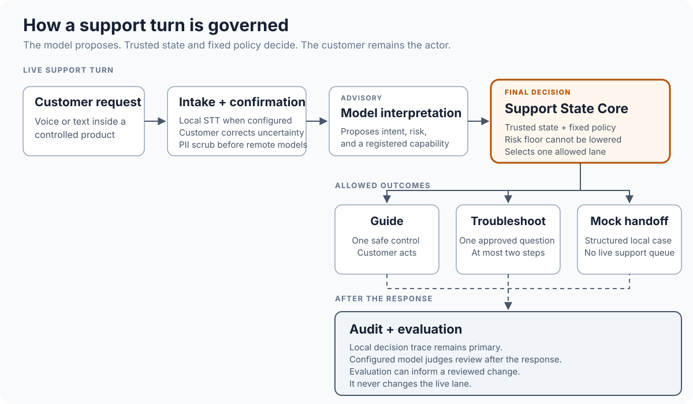

# Voice Support: State-Grounded Guidance and Safe Handoff

> This case study describes the earlier controlled demonstration shown in its video. The shared capabilities have since changed, including investigation, multi-screen guidance and customer outcome confirmation. The current Muesli integration has not been requalified; this video is not proof of that later version.

This prototype is my reimagined take on how customers seek help in B2C products. It turns typed or voice requests into one of three bounded outcomes:

1. Safe visual guidance.
2. A troubleshooting sequence with one question at a time and a maximum of two diagnostic steps.
3. A structured mock handoff for a human agent with the confirmed context on the customer's problem.

## The customer problem

When a customer gets stuck in a product and the support path takes them to a generic bot or a help-center article, we assume that the customer is going to type their problem clearly enough for the bot to fetch the right outcome. When we ask the customer to use voice input, it adds another risk: a transcription error or extra latency.

This prototype tests a narrower product idea: use Qwen to interpret the request, but use Support State Core to decide what support is allowed to do next.

This is a product hypothesis built for a controlled demo. It is not production-ready yet, and it is not based on production use or customer research.

## The experience

The hypothesis: when a customer is already inside a product and seeks support, instead of removing them from the screen they need help with, we bring the guidance and the help to them.

1. The customer types their request or records a short voice message.
2. The system transcribes the voice message and asks the customer to correct uncertain text.
3. Detected personal data is removed from the submitted text before it is sent to Qwen.
4. Qwen proposes what the customer means and how risky the request may be.
5. Support State Core checks that proposal against the current product state and fixed support rules.
6. The customer gets visual guidance, one troubleshooting question, or a structured handoff.

### Guardrails

1. The product does not click or edit anything for the customer.
2. Detected personal data is removed before the submitted text reaches Qwen.
3. Missing, stale, or invalid product context cannot produce visual guidance.

## Dependencies

1. **Voice Support**, the primary repository, owns the customer interaction, voice handling, Qwen interpretation, wording checks, audit records, and local handoff UI. [Voice Support repository](https://github.com/gititya/voice-support) — intentionally private.
2. **Support State Core**, the "brain" that I built, is the deterministic decision engine: it combines Qwen's proposed meaning with the current product context and returns the allowed support outcome. [Support State Core repository](https://github.com/gititya/support-state-core) — intentionally private.

The full prototype also depends on other private components outside these two primary repositories:

1. Screen-Aware Support for visual guidance.
2. A controlled synthetic customer app I built for this purpose.
3. Handoff policy code.
4. A support ontology.
5. Transcript processing and personal-data redaction.

See the [system design](docs/system-design.md) for how these parts connect.

## Demo

Demo video: **[Watch the walkthrough](https://www.loom.com/share/a85fb03a312c4d08a6c1bdfe21d7301b)**

Four minutes. Silence is cut. Best watched at 1.2x.

## Solving screen guidance: Screen-Aware Support

I built Screen-Aware Support to find the right control on the customer's screen and point to it. It does not click anything for the customer.

To use Screen-Aware Support, an app needs to:

1. Provide a product map with its registered screens and controls.
2. Provide the current app, screen, session, and consent state.
3. Let Screen-Aware Support find the approved control through the product map, the app's Accessibility tree, or GPT-5.6 Sol for an approved app and window.
4. Let Screen-Aware Support draw a square, circle, or caption around the control. The customer still performs the action.

I benchmarked `openai/gpt-5.6-sol` against `anthropic/claude-sonnet-5` for Screen-Aware Support. Sol won: 89 of its 90 reviewed answers and guidance decisions were correct, compared with Sonnet's 88 of 90. Neither had a safety failure. In a separate smoke test, `z-ai/glm-5.2` returned valid output in only 2 of 10 attempts and did not advance.

## Solving handoffs: Handoff engine

When the system decides that a human is needed, the handoff engine creates a structured local case. It can send:

1. The customer's confirmed request.
2. The interpreted issue and risk.
3. The account and product context used in the decision.
4. Recent product events and policy checks available in the current context.
5. Confirmed facts, open questions, possible causes, and causes that have already been ruled out.
6. The reason for the handoff.
7. What the human should check next and what the product must not promise.
8. A local case reference.

Before the case is created, a deterministic gate checks that the required fields are present. If they are not, the handoff stays held. The current prototype writes complete handoffs to a local mock inbox.

## What does another app need to use this prototype?

Another app connects through Adapter Protocol 1.0 over the local Voice Support API. It needs to provide:

1. Its product name, ID, and version.
2. The customer requests it supports and where those features live.
3. Its screens, controls, navigation paths, and safe actions.
4. Its approved troubleshooting questions, support policies, and promises that support cannot make.
5. Its available human-support channels.
6. Fresh product context for each turn: the current screen, product state, visible errors, recent events, known incidents, and where each fact came from.

The app registers this information once, then sends the current customer request and product context through the local `/api/support-adapter/1.0/` endpoints. The adapter is implemented in Voice Support. An app still has to supply its own product map and context, but it does not need a new private integration path.

## Evaluation and results

All results below come from synthetic scenarios, local test fixtures, and owner-run live journeys against a real third-party macOS app. They do not show production performance or customer impact.

| What I tested | What happened |
|---|---|
| Voice Support code | 342 tests passed in a fresh local run. |
| Qwen3.5-35B-A3B through the full Voice Support flow | All 11 synthetic product scenarios went to the expected support outcome. None of the handoff-required scenarios went to guidance, and all 8 handoff checks passed. |
| Qwen3.5-35B-A3B on 12 new support requests | Qwen got both the customer's meaning and the risk exactly right in 7 of 12 requests. After Support State Core made the final decision, 11 of 12 went to the expected outcome. |
| Parakeet and Whisper-1 speech test | On 35 synthetic clips, the best tested result left 6 clips with an error in a critical detail. A later cleanup step increased that to 10 clips for both engines, so I rejected it. |
| Support State Core | Its 69 code tests and Ruff check passed. These check that the Core's code and individual rules still work. A separate benchmark sent 152 complete examples through its decision process. Only 28 count toward the score: all 28 went to the expected outcome, none of the 16 handoff-required examples went to guidance, and the Core rescued neither of the 2 damaged-transcript examples. |

The publication check reran the code tests and the deterministic Core benchmark. It did not rerun the paid 11-scenario Qwen evaluation, so that result comes from the saved evaluation file.

See the [full evaluation](docs/evaluation.md) for the test method, individual failures, timing boundaries, and limitations.

### What I changed or kept after testing

1. **I rejected transcript cleanup.** It changed critical details in more clips instead of making the transcripts safer.
2. **I kept the higher-risk handoff rule.** Qwen misread an Invoice history request as a riskier billing request because the customer said they wanted to "claim it back on expenses." Support State Core does not lower a higher risk proposed by Qwen, so the request went to a human instead of Invoice history. I kept this rule because the opposite error—missing a genuinely risky request—would be worse.
3. **I kept one earlier Claude Haiku judge failure visible.** The customer asked for a full refund, and the handoff recorded that request. Claude Haiku treated the summary as if the product had promised the refund. I kept the wording because the handoff also said that billing review was required and a refund was not guaranteed. The later 11-scenario test judged this correctly.

## What I owned and the decisions I made

I defined the product hypothesis and translated it into the customer problem, user journeys, requirements, non-goals, system boundaries, safety model, evaluation criteria, and roadmap. I made the major product and architecture trade-offs and retained final decision authority over product behavior, architecture, scope, evaluation, and publication claims.

I used Codex and Claude Code for implementation across coding, testing, review, and documentation. I used Parakeet and Whisper-1 for transcription tests, `qwen/qwen3.5-35b-a3b` through OpenRouter for meaning, Claude Haiku 4.5 for the post-response judges, and `openai/gpt-5.6-sol`, `anthropic/claude-sonnet-5`, and `z-ai/glm-5.2` for Screen-Aware Support tests. I reviewed the resulting implementation and evidence and decided what became part of the product.

1. **The final support decision is deterministic by design.** Qwen can propose intent and risk, but Support State Core decides the support path. Given the same product context, Qwen proposal, and rules, Support State Core returns the same outcome and records why.
2. **Qwen can raise the risk, but it cannot lower it.** If Qwen interprets a request as higher risk, or misinterprets it and causes a handoff, Support State Core does not lower that risk. A handoff during uncertainty is better than an unsafe answer to the customer. The Invoice history miss above shows the accepted cost of this choice.
3. **Troubleshooting is bounded.** If the system decides that troubleshooting is needed, it asks one approved question at a time and permits a maximum of two diagnostic steps before a handoff is required.
4. **Voice plus visual guidance.** The customer can speak naturally, review the transcript, and act on a visible control. The system does not take remote control.
5. **Screen-Aware Support stays separate.** Visual target resolution can be reused, but the customer's context, support policy, risk, and action decision remain with Voice Support and Support State Core.
6. **Evaluation reporting keeps the misses.** The reports retain small samples, failed experiments, judge disagreements, and Qwen errors instead of combining them into one headline score.

See [decisions and trade-offs](docs/decisions-and-tradeoffs.md) for the options, evidence, costs, and change conditions behind each decision.

## Known limitations

1. Results come from 11 synthetic product scenarios and owner-run live journeys against a real third-party macOS app. There are no real users, customer accounts, tickets, or production metrics.
2. Human handoff ends in a local mock inbox.
3. Visual guidance relies on a private companion release and registered controlled products. It is not available for arbitrary apps or screens.
4. The Qwen, speech, Screen-Aware Support, and timing samples are small.
5. The prototype has no production controls for authentication, tenant isolation, retention, rate limits, incident response, or service monitoring.

## Other documentation

- [Customer problem](docs/customer-problem.md)
- [System design](docs/system-design.md)
- [Decisions and trade-offs](docs/decisions-and-tradeoffs.md)
- [Evaluation](docs/evaluation.md)
- [Screen-Aware Support — visual guidance without remote control](https://github.com/gititya/screen-aware-support) (private; access required)

## Copyright

Copyright © 2026 Aditya. All rights reserved.

This repository is public for review. No license is granted to reuse, modify, or distribute its contents.

## Shared journey evaluation

[Support Evals](https://github.com/gititya/support-evals) is used to review selected saved journeys from the shared Voice Support system, including whether instructions follow the current step, resolution is confirmed and a receiving system acknowledges a handoff. Voice also has its own component checks. These reviews do not establish broad app reliability or qualify the older case-study video as evidence of the current integration.
