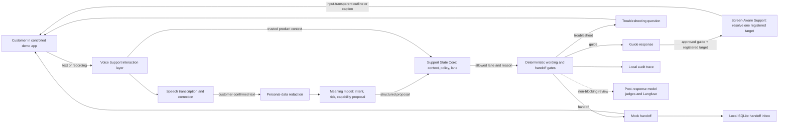

# System design

## Plain-English view

Voice Support is the interaction layer. It accepts text or a short recording, manages transcript correction, asks a model for a structured interpretation, calls the decision core, checks the final wording, records the trace, and returns guidance, a question, or a mock handoff.

Support State Core is the policy layer. It does not write conversational answers. It validates product context, applies fixed risk floors and corrections, runs bounded diagnostic rules, and returns the lane the interaction layer may use.

The two primary repositories do not form a complete public application on their own. The local demo also uses private components for the controlled customer app, transcript processing, handoff policy, and support ontology. Screen-Aware Support is a separate private companion capability used only on an approved guide path.

## Architecture

Dashed review traffic is not part of the live decision. The model judges receive the completed trace after the response path and do not block or replace the deterministic result.

## Main data flow

1. **Input:** The controlled app sends typed text or a short recording to Voice Support.
2. **Transcript check:** The speech component returns text and confidence evidence. An uncertain transcript is held until the customer edits or confirms it. The support turn starts only after submission.
3. **Personal-data boundary:** The interaction layer attempts to redact detected personal data before any configured remote model call. Redaction failure stops that call.
4. **Meaning proposal:** A model returns structured intent, risk, a registered capability proposal, a handoff summary, and a possible diagnostic question. This result is evidence, not the final policy decision.
5. **Trusted context:** Voice Support builds product context from the controlled app and pins it to the turn. Support State Core rejects missing, stale, invalid, or inapplicable context rather than guessing.
6. **Deterministic decision:** The core applies its risk floor, corrections, diagnostic protocol, and lane router. It returns guide, troubleshoot, or handoff with a reason.
7. **Response gate:** Voice Support and a separate handoff dependency enforce wording and required-record rules. The system returns one step, one question, or a handoff record.
8. **Output:** Only an approved guide result with a registered target may ask Screen-Aware Support to resolve and display that target. Troubleshoot and handoff do not enter the visual-guidance branch. A handoff result is stored in a local SQLite inbox. No path changes the customer's account.
9. **Review:** The system writes a local audit trace. Configured model judges and Langfuse receive an asynchronous copy for evaluation; their failure does not change the customer response.

## Repository and dependency boundaries

| Boundary | Responsibility | Publication status |
|---|---|---|
| Voice Support | Turn API, voice flow, transcript confirmation, redaction call, model interpretation, context construction, response wording, audit, and local handoff display | Private source at audit time |
| Support State Core | Context validation, risk floors, state corrections, diagnostics, and lane routing | Private source at audit time |
| Controlled customer app | Synthetic product state, registered screens, and demo controls | Separate private repository |
| Handoff engine | Mechanical handoff record and wording checks | Local sibling dependency; not declared as an installable Voice Support package dependency |
| Support ontology | Product and support definitions used by the interaction layer | Local sibling dependency; not declared as an installable Voice Support package dependency |
| Transcript processor | Meaning-preserving transcript handling | Local editable dependency imported by Voice Support |
| Screen-Aware Support | Optional registered-target resolution and non-interactive guidance after an approved guide decision | Separate private companion repository with a tagged v1.0.0 release; access required |
| Model and observability services | Meaning proposal, post-response judges, and trace collection when configured | External services reached with local credentials |

This case study does not include source or setup for the private companion or the other private dependencies.

## Deterministic and model-driven components

### Deterministic components

- product-context validation and applicability checks;
- state corrections and obsolete-state handling;
- minimum risk floors;
- allowed product capabilities and targets;
- diagnostic question selection and the two-step bound;
- guide, troubleshoot, or handoff routing;
- response wording and required handoff-field checks;
- customer-authority rules for visual guidance; and
- the local audit record.

These components decide what the system may do.

### Model-driven components

- structured interpretation of customer text;
- proposed intent, risk, registered capability, handoff summary, and diagnostic question;
- optional speech transcription through the configured engine; and
- post-response quality judges.

Model output can add caution or trigger a handoff. It does not override a higher deterministic risk or grant a broader action.

## Failure handling

| Failure | Current behavior |
|---|---|
| Transcript is uncertain | Hold for customer review; do not run the support decision until submission. |
| Personal-data redaction fails | Stop the remote model path and return an error or safe fallback. |
| Meaning model is unavailable, malformed, or incomplete | Treat the request as high risk or route to handoff. |
| Trusted context is absent, invalid, stale, or inapplicable | Do not guide; choose the safe handoff path. |
| Model under-reads risk | Preserve the deterministic floor and its lane. |
| Diagnostic protocol reaches its bound | Hand off with the questions and answers already collected. |
| Response contains a blocked promise or lacks handoff facts | The deterministic gate rejects the response or handoff. |
| Screen-Aware app, screen, target, frame, session, consent, geometry, or command state cannot be verified | Withhold or clear the overlay; do not point at an unregistered or stale control. |
| Audit sink, model judge, or Langfuse fails | Return the deterministic response and retain the primary local trace when possible. |

## Deployment boundary

This is not a production deployment design. The audited system runs locally with synthetic product state. It has no public service boundary, production identity, tenant isolation, real support queue, customer-record integration, retention policy, operational service levels, or incident process.

The [roadmap](roadmap.md) lists what a production deployment would require without treating those items as implemented.
